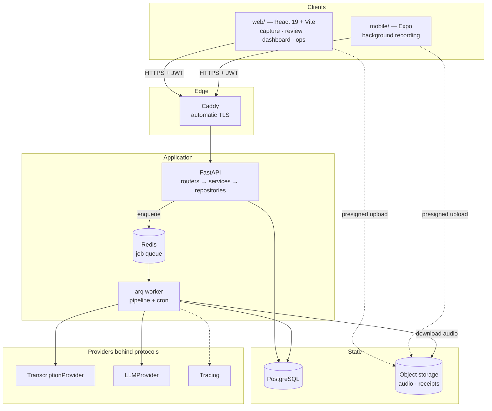

# VisitNote AI

Turns a recorded home care or home health visit into a structured, compliance-ready
note — and tells the user what is missing before they sign it.

A caregiver finishes a shift and talks for ninety seconds about what happened. A nurse
dictates a recap in the car. The audio is transcribed with speaker diarization, an LLM
structures it into the correct note format, and a flag engine marks every element a
reviewer or auditor would expect to find and did not. The user edits, signs, and exports.

The hard part is not generating text. It is **not generating text that isn't true**, and
proving that property holds across releases. See [AI reliability](#ai-reliability).

---

## Status

This is an in-progress build. The table is the source of truth; nothing below claims to
work unless it says so here.

| Phase | Scope | State |
|---|---|:--|
| 1 | Monorepo scaffold, FastAPI layers, Alembic, arq worker, `/healthz`, web shell, CI | **done** |
| 2 | Auth: argon2, JWT access + rotating refresh with reuse detection, Google OAuth | **done** |
| 3 | Capture on web: idempotent visits, R2 multipart upload with resume, `MediaRecorder` | **done** |
| 4 | Pipeline: ffmpeg → diarized transcription → templated generation, retries, cost recording | **done** |
| 5 | Review: schema-driven section editor, flags panel, version-checked edits, sign-off, PDF | planned |
| 5b | Eval suite: golden dataset, fabrication checker, CI gate, prompt promotion | planned |
| 6 | Billing: plans, entitlement engine, grace, quota-on-ready, manual activation | planned |
| 7 | Agency dashboard: review queue, analytics, charts | planned |
| 8 | Share links, audio deletion, audit log, operator console | planned |
| 9 | Landing page, public demo, documentation | planned |
| 10 | Native client (Expo) — background and lock-screen recording | planned |
| 11 | Second billing provider against the existing protocol | planned |

The full specification is [`visitnote-claude-code-prompt-v8.md`](visitnote-claude-code-prompt-v8.md);
[`SPEC-CHANGELOG.md`](SPEC-CHANGELOG.md) records why it says what it says.

---

## Architecture

One FastAPI service owns the database. Every client is a consumer of one versioned REST
API and generates its types from that API's OpenAPI schema, so a backend contract change
surfaces as a TypeScript compile error rather than a runtime surprise.



### Why it is shaped this way

**`routers/` → `services/` → `repositories/`.** Routers do HTTP and nothing else; they
never touch a database session. Business rules live in services, queries live in
repositories. The payoff is that the entitlement engine, the pipeline, and the eval
runner all call the same service code without a request object in sight.

**The pipeline runs in a worker, not a request.** Transcription and generation take tens
of seconds and fail in ways that need retrying. The API enqueues and returns; the client
polls. One worker container, so cron jobs cannot double-fire.

**Providers sit behind protocols.** `LLMProvider` and `TranscriptionProvider` are
`typing.Protocol` definitions. No vendor SDK type is allowed to escape its provider
module — the pipeline, the evals, and the tracing layer only ever see local types. Tests
inject fakes and never call a paid API. Model identifiers live in configuration and in
the `note_templates` row, never in code.

**Notes are stored twice, on purpose.** `notes.sections` is JSONB because its shape
varies per template and nothing queries into it. Flags are *also* written to a normalized
`note_flags` table, because five dashboard views aggregate across flag codes and that
promise is not keepable against a JSONB array at volume. Both writes happen in one
transaction, with a test asserting they never diverge.

**Everything is UTC, and shifts cross midnight.** All timestamps are `TIMESTAMPTZ`; the
capturing user's IANA timezone rides on the visit. A 22:00–06:00 shift is the normal case
in home care, and subtracting clock times to get its duration yields a negative number and
a false "missing shift times" flag. There is a test for it.

---

## AI reliability

An LLM that invents a vital sign in a clinical note is not a quality problem, it is a
billing and liability problem. The controls are structural rather than aspirational.

**Never invent.** No transcript support for a section means a null section plus a flag —
never a plausible sentence. A named intervention with no stated rationale is recorded as
the intervention plus `MISSING_NECESSITY_RATIONALE`; the rationale is never supplied by
the model.

**Diarization is a correctness control, not a feature.** A home visit has two to four
speakers. Attributing a quote to the wrong one is a fabrication, and it is the easiest one
to commit. Transcripts are stored as ordered speaker turns; a statement whose speaker
cannot be determined never becomes a patient quote — it raises `UNATTRIBUTED_STATEMENT`.

**Prompts are versioned artifacts.** They live in code as immutable version modules. A
change is a new file, never an edit. Every note records the prompt version, provider, and
model that produced it, so any output can be traced to exactly what generated it.

**Promotion is gated on evidence.** A prompt version becomes active only after an eval run
that passes its thresholds — critical-flag recall ≥ 0.95, overall flag F1 ≥ 0.90, schema
validity 100%, and **zero** fabrication failures. The fabrication checker verifies that
every number, vital, time, measurement, and medication name in the output appears in the
transcript, and that every patient-attributed quote appears in a turn belonging to that
speaker. The check runs in CI on any change under `app/llm/` or `evals/`.

**Cost is a first-class metric.** Audio minutes, input and output tokens, and computed USD
are recorded per note, so margin against plan revenue is visible rather than inferred.

> **Eval results are not yet published.** `EVALS.md` is generated by the eval runner and
> will appear at the repository root when phase 5b lands. Until then there are no scores
> to quote, and this section describes design intent rather than measured behaviour.

---

## Repository layout

```
backend/    FastAPI API + arq worker (one image, two commands)
  app/
    api/            routers, dependencies
    core/           config, logging, database session
    models/         SQLAlchemy 2.0 declarative models
    repositories/   all database access
    services/       business rules
    llm/            providers, prompt versions, pipeline
  alembic/          migrations, including template seed data
  evals/            golden dataset, checkers, runner
  tests/
web/        React 19 + Vite SPA (capture, review, dashboard, operator console)
mobile/     Expo client (phase 10)
deploy/     bootstrap, deploy, backup scripts
```

---

## Running locally

Requires Docker with the Compose plugin, and Node 22 for the web client.

```bash
cp .env.example .env          # defaults work for local development as-is
docker compose up --build     # api, worker, postgres, redis, minio
```

The API comes up on <http://localhost:8000>:

| | |
|---|---|
| Health | <http://localhost:8000/healthz> |
| Interactive docs | <http://localhost:8000/docs> |
| OpenAPI schema | <http://localhost:8000/api/v1/openapi.json> |
| Object storage console | <http://localhost:9001> (`minioadmin` / `minioadmin`) |

**Object storage runs locally.** MinIO speaks the S3 API, so the same provider code
runs against it and against Cloudflare R2 in production. It is not optional scenery:
without a real bucket the upload is accepted and discarded, and the pipeline then
fails at download on every recording.

Note that `R2_ENDPOINT_URL` and `R2_PUBLIC_ENDPOINT_URL` differ locally. The API
reaches MinIO at `minio:9000` on the compose network while the browser can only reach
`localhost:9000`, and a presigned URL is signed over the host it will be sent to — so
the difference has to be applied at signing time rather than patched afterwards. In
production both are R2, and the public one is left unset.

**Without provider keys, the pipeline still runs end to end.** With `ANTHROPIC_API_KEY`
and `DEEPGRAM_API_KEY` unset, the transcription and LLM providers fall back to fakes:
a recording is transcribed to a fixture conversation and the note comes back with every
section filled with an obvious placeholder. That is deliberate — the alternative is a
checkout that cannot demonstrate its central feature — and production refuses to start
without the real keys rather than quietly writing fixtures into clinical records.

Migrations run as an explicit step, never on container startup — the same rule the deploy
pipeline follows, so local and production behave identically:

```bash
docker compose run --rm api alembic upgrade head
```

The web client:

```bash
cd web && npm install && npm run dev      # http://localhost:5173
npm run generate:api                      # regenerate types from the running API
```

---

## Testing

```bash
docker compose run --rm api pytest        # against a real PostgreSQL, not SQLite
docker compose run --rm api ruff check .
docker compose run --rm api mypy app
cd web && npm run typecheck && npm test
```

Backend tests run against real PostgreSQL because half of what is worth testing —
cross-tenant isolation, aggregation correctness, unique constraints, `TIMESTAMPTZ`
behaviour across a DST boundary — does not exist in SQLite.

---

## Privacy and compliance posture

**This repository runs in demo mode: fictional and simulated audio only.** Free
infrastructure tiers do not come with executed Business Associate Agreements, and a
missing BAA is a violation regardless of how strong the encryption is.

Before any real visit is recorded, the deployment moves to paid tiers with executed BAAs
from the transcription provider, the model provider, the object store, and the database
host. The vendor checklist and resulting cost floor are documented rather than discovered.

**A pseudonymous client label does not de-identify a recording.** The `clients` table
stores a label and users are instructed not to enter full names, which limits database
exposure and nothing else. The audio carries the patient's voice, conditions, medications,
and often their household details. It is PHI.

Additional controls: private bucket with short-expiry presigned URLs; raw audio deleted 24
hours after sign-off; audit logging on every read, edit, sign, export, share, and
administrative action; login throttling and refresh-token reuse detection; every
repository query scoped to the requesting user, with tests proving cross-tenant access
fails.

Selling into California adds the Confidentiality of Medical Information Act, which is
stricter than HIPAA in places and carries a private right of action, plus CCPA/CPRA.

Every generated note carries a disclaimer that it is a draft requiring review by the
responsible caregiver or clinician, and is not medical advice or a medical device. The
skilled nursing template requires licensed-nurse validation before commercial use.

---

## Scope

Deliberately out of scope for the MVP: EHR integrations, real-time transcription,
multi-language, offline generation, and iOS distribution.

**OASIS assessments are a deliberate deferral, not an oversight.** They are the single
feature Medicare-certified home health agencies most want, and they are a large,
separately regulated assessment instrument that deserves its own design rather than a
corner of an MVP.

---

## Licence

Not yet licensed. All rights reserved pending a decision.
